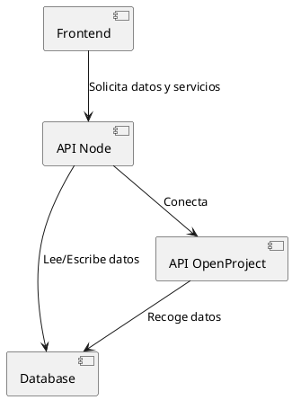

# Autis

### Problema planteado
La empresa necesita una herramienta centralizada y accesible para la gestión de proyectos, que permitiera una mejor planificación, seguimiento de tareas, control de tiempos y usuarios.

### Solución adoptada
Se ha optado por implementar OpenProject, una plataforma de código abierto que cumple con los requisitos funcionales de la empresa.


### Tecnologías utilizadas
```
- Docker + Docker Compose
- PostgreSQL
- HTML
- CSS
- JavaScript
- Node
- Express
- Chart
```

### Diagrama de componentes (PlantUML)

